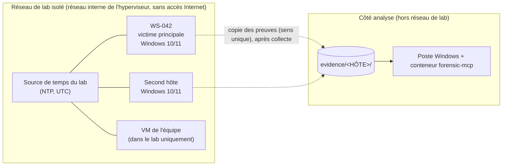

# L3 — Scénario d'incident, preuves et vérité terrain

*Squelette du 02/10/2026, tâche 3.1, partie défensive uniquement. Les procédures d'attaque sont
choisies et rédigées par l'équipe humaine (L. Plancke, W. Triffault) à partir de la documentation
officielle des tests retenus ; l'assistant n'en rédige, n'en propose et n'en complète aucune.
Jalon M3 : J6 (05/10/2026).*

## 1. Objectifs

Produire, sur un lab isolé, un incident simulé dont **la vérité terrain est connue**, afin de
mesurer l'apport de l'assistant (CDC §6) :

| Objectif CDC | Ce que le lab doit fournir |
|---|---|
| O1 — ≥ 30 % de temps de triage en moins | Les mêmes preuves pour l'enquête classique et l'enquête assistée |
| O2 — ≥ 80 % des IOC et étapes retrouvés | Une vérité terrain complète : `eval/ground_truth.yaml` |
| O3 — 100 % des appels tracés | Preuves enregistrées (SHA-256) avant toute analyse, journal d'audit |
| EF-05 — chaîne de preuve | Empreintes avant / après, manifestes, fiche de possession |

## 2. Topologie du lab



| Élément | Exigence |
|---|---|
| Réseau | Réseau interne de l'hyperviseur, **sans passerelle vers Internet ni vers le réseau de l'école** ; vérifier avant le scénario qu'aucune VM ne joint l'extérieur |
| Victimes | `WS-042` (victime principale) et un second hôte Windows 10/11 ; comptes de test uniquement, aucune donnée réelle |
| VM de l'équipe | Uniquement sur le réseau de lab ; détruite ou restaurée après le scénario |
| Côté analyse | Poste Windows avec Docker et `forensic-mcp` ; **jamais connecté au réseau de lab** ; les preuves arrivent par copie après collecte |
| Instantanés | Pour chaque VM : `T0-propre` (après installation), `T1-journalisation` (après `lab/prepare_victim.ps1` et `lab/check_logging.ps1` tout OK), `T2-après-scénario` (**avant** la collecte) |
| Horloges | Toutes les VM sur **la même source NTP du lab** ; noter le fuseau de chaque VM et l'écart d'horloge (`w32tm /stripchart`) avant le scénario et après la collecte (section 8) ; la vérité terrain est **en UTC** |

## 3. Hôte WS-042

| Champ | Valeur (à remplir par l'équipe) |
|---|---|
| Nom d'hôte | `WS-042` |
| Version Windows (build) | |
| Fuseau horaire (`tzutil /g`) | |
| Comptes de test | |
| Office installé (version) | |
| Sysmon (oui / non, version, configuration) | |
| Instantanés pris (T0, T1, T2) avec heure UTC | |

Second hôte : même fiche.

## 4. Journalisation à activer (avant le scénario)

Sans cette journalisation, les preuves attendues n'existeront pas : « aucun événement » ne
voudra pas dire « aucune activité ». Les deux scripts ne font que configurer ou lire la
journalisation ; ils ne changent aucun autre réglage.

| Réglage | Événements | Utile pour | Activé par | Vérifié par |
|---|---|---|---|---|
| Audit « Process Creation » + ligne de commande | 4688 avec `CommandLine` | exécution, chaîne de processus | `prepare_victim.ps1` (auditpol par GUID + `ProcessCreationIncludeCmdLine_Enabled`) | `check_logging.ps1` |
| Audit « Other Object Access Events » | 4698–4702 (tâches planifiées) | persistance | idem | idem |
| Audit « Logon », « Logoff », « Special Logon », « Other Logon/Logoff Events », « Credential Validation » | 4624, 4625, 4634, 4647, 4648, 4672, 4778, 4779, 4776 | ouvertures de session, RDP | idem | idem |
| Audit « Security System Extension » | 4697 (service installé) | persistance | idem | idem |
| Audit « Audit Policy Change », « Security State Change » | 4719, 4608 | modification de l'audit, redémarrages | idem | idem |
| `SCENoApplyLegacyAuditPolicy = 1` | — | empêche l'ancienne stratégie d'écraser les sous-catégories | idem | idem |
| PowerShell Script Block Logging et Module Logging | 4104, 4103 | contenu des scripts PowerShell | `prepare_victim.ps1` (stratégie machine) | idem |
| Journal TaskScheduler/Operational activé | 106, 140, 141, 200 | persistance | `prepare_victim.ps1` | idem |
| Taille des journaux | Security 1 Go ; System, PowerShell, TaskScheduler, TerminalServices 256 Mo | éviter l'écrasement des premiers événements | `prepare_victim.ps1` (`-SecurityLogMB`, `-OtherLogMB`) | idem |
| Sysmon (optionnel) | 1, 3, 11, 13… | complément (réseau, fichiers, registre) | `prepare_victim.ps1 -SysmonExe -SysmonConfig` (installeur **local**, signature vérifiée) | `check_logging.ps1` (WARN si absent) |

Le journal Security journalise toujours son effacement (1102), et System celui des autres
journaux (104) : rien à activer.

**Procédure (en administrateur sur chaque victime) :**

1. Restaurer `T0-propre`, synchroniser l'horloge, noter le fuseau.
2. `powershell -ExecutionPolicy Bypass -File lab\prepare_victim.ps1` (option `-WhatIf` pour voir
   les changements sans les appliquer).
3. `powershell -ExecutionPolicy Bypass -File lab\check_logging.ps1 -OutFile C:\lab\WS-042_logging.json` :
   **chaque ligne doit être OK** (code de sortie 0). Conserver le rapport JSON avec la fiche du lab.
4. Prendre l'instantané `T1-journalisation`.

## 5. Étapes du scénario (CDC)

Les colonnes « ATT&CK », « Procédure d'attaque » et « Horodatage » sont **remplies par l'équipe
humaine uniquement**, d'après les tests réellement joués. La dernière colonne indique la
journalisation (section 4) nécessaire pour que l'étape laisse des traces.

| # | Étape (CDC) | ATT&CK (équipe) | Procédure d'attaque (équipe) | Horodatage UTC (équipe) | Journalisation nécessaire |
|---|---|---|---|---|---|
| 1 | Macro Office → PowerShell encodé | | | | 4688 + ligne de commande, 4104/4103, Sysmon 1/3 ; dump mémoire |
| 2 | Persistance : tâche planifiée + clé Run | | | | 4698, TaskScheduler 106/140, 4697/7045 ; ruches de registre |
| 3 | Vol d'identifiants + RDP vers un second hôte | | | | 4624/4625/4648/4672, 4778/4779, TerminalServices 1149/21/25 sur les deux hôtes ; dump mémoire |
| 4 | Archive dans un dossier temporaire | | | | $MFT et $J (collecte KAPE), 4688 |
| 5 | Collecte | | | | 4688, 4104, Sysmon 3 ; dump mémoire (connexions) |

## 6. Collecte des preuves (après le scénario)

Ordre de volatilité : **mémoire d'abord**, puis disque et journaux. Prendre `T2-après-scénario`
avant toute collecte.

1. Dump mémoire de chaque hôte (WinPmem), vers un support de collecte du lab.
2. Collecte KAPE de chaque hôte : `$MFT`, `$J`, ruches de registre (SYSTEM, SOFTWARE, SAM,
   SECURITY, NTUSER.DAT, UsrClass.dat, Amcache.hve), journaux EVTX, prefetch, profils utilisateurs.
3. Copie à sens unique vers le côté analyse, dans l'arborescence attendue par le serveur :

```
evidence/
  WS-042/
    case.toml          # case = "WS-042", classification = "lab"
    memory/WS-042.raw
    kape/C/...         # arborescence KAPE telle quelle
  <second hôte>/
    case.toml
    memory/...
    kape/...
```

`case.toml` fixe la classification (`lab` pour le scénario) ; sans lui, le serveur applique
`internal` (pseudonymisation en mode cloud).

## 7. Chaîne de possession (EF-05)

**Avant toute analyse**, dans le conteneur :

```
docker compose exec forensic python scripts/register_evidence.py WS-042 --analyst "Prénom Nom"
```

Chaque fichier est haché (SHA-256), enregistré et journalisé (`evidence_registered`, au nom de
l'analyste) ; un manifeste est écrit dans `/output/manifests/` (les preuves sont en lecture
seule). **Recopier hors du poste** l'empreinte du manifeste et le hash de tête du journal
affichés (fiche de possession, section 8).

**À la fin de l'analyse :**

```
docker compose exec forensic python scripts/register_evidence.py WS-042 --analyst "Prénom Nom" --after
```

Chaque fichier enregistré est re-haché (`evidence_verified`, étape « after ») ; le script signale
tout fichier modifié, manquant ou ajouté et sort en erreur (code 1). `report_export(final=true)`
re-hache aussi les preuves citées.

## 8. Fiche de session (à remplir par l'équipe)

| Champ | WS-042 | Second hôte |
|---|---|---|
| Rapport `check_logging.ps1` : tout OK (oui / non), fichier | | |
| Écart d'horloge avant le scénario (s) | | |
| Début / fin du scénario (UTC) | | |
| Instantané T2 (UTC) | | |
| Dump mémoire : outil, version, heure UTC, taille | | |
| Collecte KAPE : version, cibles, heure UTC | | |
| Écart d'horloge après la collecte (s) | | |
| Manifeste « before » : empreinte SHA-256 | | |
| Hash de tête du journal après enregistrement | | |
| Manifeste « after » : empreinte, résultat OK / NOT OK | | |
| Intervenants | | |

## 9. Vérité terrain

`eval/ground_truth.yaml` (schéma `eval/ground_truth.schema.json`) est rempli par l'équipe **après**
le scénario : pour chaque étape, techniques ATT&CK confirmées, horodatage UTC, référence de la
procédure jouée, IOC, et faits attendus (artefact, chemin de la preuve, outil du serveur, champ,
valeur ; `result_id` et `row` après une exécution de référence). Le fichier passe de
`status: template` à `status: filled` ; le schéma impose alors que chaque étape soit renseignée.
Il sert à la notation de la phase P7 (`eval/score.py`).

## 10. Partage des rôles

| Qui | Quoi |
|---|---|
| Équipe humaine | Construire le lab, choisir et rédiger les procédures, jouer le scénario, collecter, remplir la fiche de session et la vérité terrain |
| Assistant (agent de développement) | Scripts de journalisation et de vérification, script de chaîne de possession, modèle et schéma de vérité terrain, ce squelette ; **aucune étape d'attaque** |
